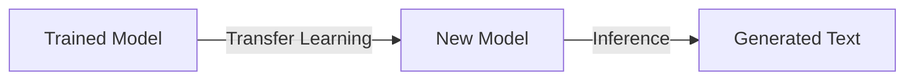

# Lyrics Generator
An exploration to 'Artificial Creativity', using LSTM and transfer learning to create a lyrics-generating machine. 
Codes following fastai's workshop



## Installation
Firstly, clone the repository to a folder of your choice. 

The project has been dockerised to simplify testing and deployment on local machine. 
Simply navigate to the project folder and run the buildfile provided.

```bash
bash build.sh
```

## Directory Structure
I did not upload the dataset and model to reduce space on my github. 
Here's my tree diagram which you can follow if you want to run the build.sh file successfully. 

```bash
├── build.sh
├── data
│   ├── lm_databunch
│   └── songdata.csv
├── Dockerfile
├── model
│   └── ft_enc_base.pth
├── README.md
├── requirements.txt
├── src
│   ├── app.py
│   └── train.py
└── Training_a_Song_Generator_with_ULMFiT.ipynb
```

## Usage
1. Input the number of words you want in the generated song.
2. Input the starting line of the song.
3. Choose how 'creative' you want the model to be.  

## Data Source
Kaggle

## Resources 
The following resources were referenced to implement this project:
- Fast ai: [A Code-First Introduction to NLP](https://www.youtube.com/watch?v=PNNHaQUQqW8&list=PLtmWHNX-gukKocXQOkQjuVxglSDYWsSh9&index=8)

## Further Exploration
- Generating songs of different genres
- Mimicking different artists i.e. what if Jimi Hendrix or The Beatles still writing songs?
- Adding text to speech feature
- Adding music generator (looking at Google Magenta)

## To Do
- Guide on how to train model and get the databunch and model ready
- File tree so that users can re-create the folder arrangement
